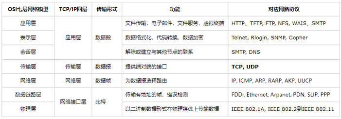
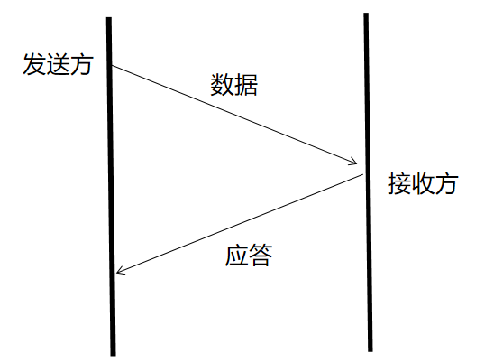

# 通信协议 #
## 一、网络分层架构 ##

## 二、TCP和UDP协议 ##
### 1.UDP协议 ###
UDP（user Datagram Protocol）:用户报文协议 
没有任何特点 
和TCP对比：不可靠、无连接、面向报文 
**1.UDP作为一种简单的传输层协议，基本上没有什么操作来帮助用户处理复杂的网络环境，所以UDP保留下来这种不可靠的特性。**

**2.UDP报文的头信息(定长的(8字节))**

**3.校验和（checksum）的作用和工作机制** 

- 判断收到的报文(数据)是否出现差错的
- 利用**hash函数**的原理：通过设计一种hash函数，达到冲突率很低的一种情况
  **发送端**:checksum(payload)=>校验和1（把校验和1填写到UDP的header中）
  **接收端**:checksum(payload)=>校验和2
  **比较**校验和2和header中的校验和1：如果**不等**，payload在传输过程中一定**出现差错了**；如果**相等**，**大概率payload没有出现出错**
- 针对校验和可以对上的情况，**正常接收数据**。
  针对校验和**对不上的情况，直接丢包**；UDP**不是特别可靠**

**4.UDP协议栈的作用** 

1. **计算校验和**
1. **填写正确的header信息**
1. **把header + payload一起交给网络层**(*重点：UDP没有**发送**缓冲区)
1. **网络层发送数据到网卡**
1. **send方法返回**
 *重点：我们在应用层调用send方法时方法返回了，就**意味着数据已经到达了网络层中**

接收到数据后

1. **计算校验和**
1. **解包**
1. **通知指定的进程，数据已经到达...这段期间**，进程可能还暂时来不及过来取数据。所以UDP协议栈需要找个地方把数据暂存一会儿。UDP协议栈中有**接收缓冲区**。

**5.UDP有接收缓冲区，没有发送缓冲区** 

用戶发送多少数据，UDP也会发送多少数据，所以**UDP是面向报文的** 
UDP发送数据无需任何准备工作，随时随地可以发送：寄件VS打电话，所以UDP是**无链接的**

**6.面向报文导致的一个后果** 

由于底层(物理层+网络层)都对**一次发送**的数据大小限制。如果强行发送大于限制的数据，就会出现数据被截断 
**全双工**：同一个通道是双向的

**7.UDP协议的最适合场景** 
对实时性要求较高、对可靠性要求较低的场景
实时聊天(语音、视频聊天)
UDP支持广播。如果有广播需求可以考虑UDP。

### 2.TCP协议 ###
TCP(Transmission Control Protocol):传输控制协议

**1.目标** 

- 以进程为单位传递数据
- 追求可靠性

**2.什么是可靠性** 
TCP只能保证自己最大的可能，把数据有序地发送给对方。但**不能保证一定发送给对方** 

1. 尽可能去**发送**给对方
1. 就算发不过去，也有**反馈**
1. 保证对方接收是**有序的**
1. 保证对方**不会收到差错数据**
1. **TC**会设计一些机制，来尽可能的**优化网络**，提高对方收到的可能性

**TCP使用什么样的机制，来保证可靠性 -- 确认应答机制**

    TCP发送的数据，一般被称为segment(数据段)

    应答：acknowledge

1. 如果发送方同时发送了多条segment，应答进行了多次应答。发送方如何得知，接收方收到的是那一次的segment? 
 **编号机制**：发送方为发送的数据做编号，应答的时候带上对应编号即可。
1. 如果接收方没有收到数据，则不会应答；或者接收方应答了。但应答丢包了 
 总之：发送方没有收到对应的应答。则认为对方没有收到数据 -- **超时重传机制**

**3.TCP协议的header格式** 
https://blog.csdn.net/qq_57574258/article/details/123024217

## 三、域名解析及为什么选用UDP协议 ##
1.
http://news.sohu.com/a/529566154_657867