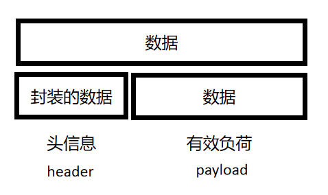

# 通信协议 #
## 一、TCP和UDP协议 ##
### 1.UDP协议 ###
UDP（user Datagram Protocol）:用户报文协议 
没有任何特点 
和TCP对比：不可靠、无连接、面向报文 
**1.UDP作为一种简单的传输层协议，基本上没有什么操作来帮助用户处理复杂的网络环境，所以UDP保留下来这种不可靠的特性。**

**2.UDP报文的头信息(定长的(8字节))**

**3.校验和（checksum）的作用和工作机制** 

https://blog.csdn.net/qq_57574258/article/details/123024217

## 二、域名解析及为什么选用UDP协议 ##
1.