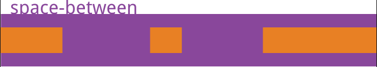

# HTML #

### 1.flex：1 ###

即为flex-grow：1，经常用作自适应布局，将父容器的display：flex，侧边栏大小固定后，将内容区flex：1，内容区则会自动放大占满剩余空间。

### 2.dl标签相关 ###

### 3.行内标签与块级标签 ###

	{/* 1.行级标签 */}

            {/* 1.1特点 */}
            {/* 可以和其他元素保持在同一行,不可以自动换行,但不能设置宽高
			行内标签（内联标签）不占有独立的区域，仅仅靠自身的字体大小和图像尺寸来支撑结构，一般不可以设置宽度，高度，对齐等属性，常用于控制页面中文本的样式
			 */}
			和相邻行内标签在一行上
			高、宽无效，但水平方向的padding，margin可以设置，垂直方向的无效
			行内标签只能容纳文本或者其他行内标签(a特殊 ，a标签里面可以放块级元素)

            {/* 1.2常见行级标签 */}
            
            
            <u></u> {/* 下划线 */}
            <em></em> {/* 强调 */}
            <i></i> {/* 斜体 */}
             {/* 下标 */}
             {/* 上标 */}

    {/* 2.块级标签 */}

            {/* 2.1特点 */}
            {/* 不可以和其他元素保持在同一行(独占一行)，可以自动换行，能设置宽高 */}

			总是从新行开始
			高度、行高、外边距以及内边距都可以控制
			宽度默认是容器的100%
			可以容纳内联标签和其他标签

            {/* 2.2常见块级标签 */}
            

            

            <h1-h6></h1-h6>
            <ul></ul>
            <li></li>
            <dl></dl> {/* 定义列表，跟ul...li类似 */}
            <dt></dt> {/* 定义列表中的项目 */}
            
    {/* 3.行内块级标签 */}

            {/* 3.1特点 */}
            {/* 可以和其他元素保持在一行，还能设置宽高 */}
			和相邻行内标签（或者行内块）在一行上，但是之间有空白缝隙
			默认宽度就是它本身内容的宽度
			块、行内标签转换为行内块：display:inline-block;

            {/* 3.2常见行内块级标签 */}
            <textarea name="" id="" cols="30" rows="10"></textarea>
            <input type="text" />
            
            <button></button>
## 3.弹性布局flex ##

任何一个容器都可以指定为Flex布局。

    .box{
      display: flex;
    }

行内元素也可以使用Flex布局。

	.box{
	  display: inline-flex;
	}

Webkit内核的浏览器，必须加上-webkit前缀。

	.box{
	  display: -webkit-flex; /* Safari */
	  display: flex;
	}

注意，设为Flex布局以后，**子元素的float、clear和vertical-align属性将失效**。

容器默认存在两根轴：水平的**主轴**（main axis）和垂直的**交叉轴**（cross axis）。主轴的开始位置（与边框的交叉点）叫做main start，结束位置叫做main end；交叉轴的开始位置叫做cross start，结束位置叫做cross end。

项目默认沿主轴排列。单个项目占据的主轴空间叫做**main size**，占据的交叉轴空间叫做**cross size**。

### 一.容器的属性 ###

- flex-direction
- flex-wrap
- flex-flow
- justify-content
- align-items
- align-content

#### 1.1.flex-direction属性 ####
flex-direction属性决定主轴的方向（即项目的排列方向）。

	.box {
	  flex-direction: row | row-reverse | column | column-reverse;
	}

它可能有4个值。

- row（默认值）：主轴为水平方向，起点在左端。
- row-reverse：主轴为水平方向，起点在右端。
- column：主轴为垂直方向，起点在上沿。
- column-reverse：主轴为垂直方向，起点在下沿。

#### 1.2.flex-wrap属性 ####
默认情况下，项目都排在一条线（又称”轴线”）上。flex-wrap属性定义，如果一条轴线排不下，如何换行。

	.box{
	  flex-wrap: nowrap | wrap | wrap-reverse;
	}

它可能取三个值。

（1）nowrap（默认）：不换行。

（2）wrap：换行，第一行在上方。

（3）wrap-reverse：换行，第一行在下方。

#### 1.3.flex-flow ####
flex-flow属性是flex-direction属性和flex-wrap属性的简写形式，默认值为row nowrap。

	.box {
	  flex-flow: <flex-direction> <flex-wrap>;
	}

#### 1.4.justify-content属性 ####
justify-content属性定义了项目在主轴上的对齐方式。

	.box {
	  justify-content: flex-start | flex-end | center | space-between | space-around;
	}

它可能取5个值，具体对齐方式与轴的方向有关。下面假设**主轴为从左到右**。

(1)flex-start（默认值）：左对齐

(2)flex-end：右对齐

(3)center： 居中

(4)space-between：两端对齐，项目之间的间隔都相等。

(5)space-around：每个项目两侧的间隔相等。所以，项目之间的间隔比项目与边框的间隔大一倍。

#### 1.5.align-items属性 ####
align-items属性定义项目在交叉轴上如何对齐。

	.box {
	  align-items: flex-start | flex-end | center | baseline | stretch;
	}

它可能取5个值。具体的对齐方式与交叉轴的方向有关，下面假设交叉轴从上到下。

- flex-start：交叉轴的起点对齐。
- flex-end：交叉轴的终点对齐。
- center：交叉轴的中点对齐。
- baseline: 项目的第一行文字的基线对齐。
- stretch（默认值）：如果项目未设置高度或设为auto，将占满整个容器的高度。

#### 1.6.align-content属性 ####
align-content属性定义了多根轴线的对齐方式。如果项目只有一根轴线，该属性不起作用。

	.box {
	  align-content: flex-start | flex-end | center | space-between | space-around | stretch;
	}

该属性可能取6个值。

- flex-start：与交叉轴的起点对齐。
- flex-end：与交叉轴的终点对齐。
- center：与交叉轴的中点对齐。
- space-between：与交叉轴两端对齐，轴线之间的间隔平均分布。
- space-around：每根轴线两侧的间隔都相等。所以，轴线之间的间隔比轴线与边框的间隔大一倍。
- stretch（默认值）：轴线占满整个交叉轴。

### 二.项目的属性 ###
以下6个属性设置在项目上。

- order
- flex-grow
- flex-shrink
- flex-basis
- flex
- align-self

#### 2.1.order属性 ####

https://blog.csdn.net/m0_48958478/article/details/125508280