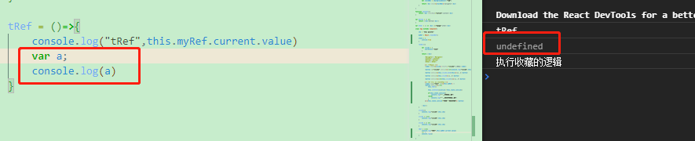
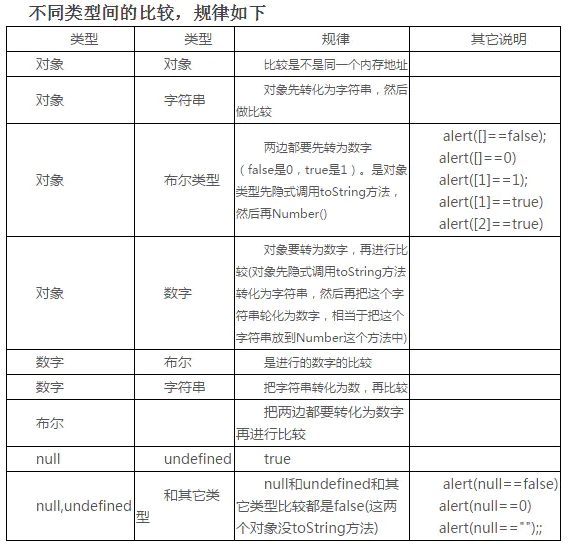
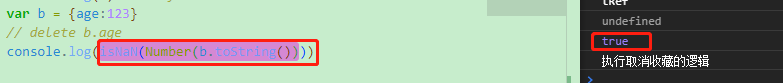
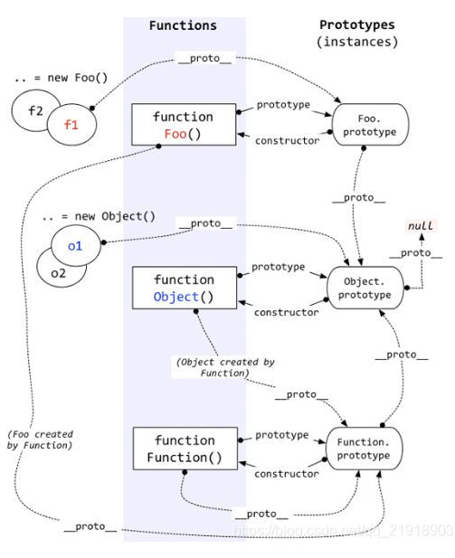

# JavaScript相关知识点 #

## 1.《学习JavaScript数据结构与算法》 ##

1.http-serve - js服务器,http-serve打开指定的端口访问

2.undefined - 声明变量未赋值

3. 
  1=="1" 对的 toNumber("1") = 1 1==1

  1===1 对的

4.delete运算符

5.js中的false

undefined null NaN +0 -0 长度为0的字符串 false

6.对象始终为true

> new Biilean(false) - true
> 
> new String('') - true
> 
> new Number(NaN) - true
> 
> {} - true

7.当使用 == 做比较时候会按照下表进行转换后比较

**例子**： console.log('packt'==true) ? 
输出为**false**

字符串与布尔比较，字符串转为数字再比，数字与字符串比较，字符串转为数组再比，则toNumber(true) = 1 , toNumber('packt') = NaN
1 != NaN , 所以结果为false，其余的也做同类型表

**关于** toPrimitive  
js的内部函数 - **数组就是对象**

> 对象转原始类型会调用内置的[toPrimitive]函数，该函数逻辑如下：
> 如果已经原始类型，就不需要转换
> 调用x.valueOf()，如果转换为基础类型，就返回转换的值
> 调用x.toString()，如果转换为基础类型，就返回转换的值
> 如果没有返回原始类型，就会报错

**什么时候使用？** - 对象类型与字符串或者数字比较的时候

**值得注意的是：** NaN不等于NaN NaN也不等于undefined  
使用isNaN判断

Number(b.toString())==Number(b.toString())  - 也返回false

8.当使用 === 判断时候，类型不相同直接返回false

**值得注意的是：**两个对象比较时候，两个引用同一个对象的时候才true，不同对象但相同结构仍为false(指针相关)，引用类型；--数组也是如此

9.面向对象编程时，对象是类的实例

10.js中函数原型只有一个形参时，传两个实参不会报错

11.什么时候用while什么时候用for？

知道执行次数的时候一般用for，条件循环时一般用while。

12.关于**函数原型** - prototype

使用函数原型定义函数时，函数只会被创建一次，直接定义则每个实例都会创建自己的函数副本。使用原型节约内存

### 原型 ###

proto（隐式原型）与prototype（显式原型，也叫原型对象）

①.是什么

> 显式原型：每一个函数在创建之后都会拥有一个名为prototype的属性，这个属性指向函数的原型对象。
> 
> 隐式原型：JavaScript中任意对象都有一个内置属性[[prototype]]，在ES5之前没有标准的方法访问这个内置属性，但是大多数浏览器都支持通过__proto__来访问。ES5中有了对于这个内置属性标准的Get方法
> Object.getPrototypeOf(). Object.prototype 这个对象是个例外，它的__proto__值为null

②.两者的关系和作用

>     关系：隐式原型指向创建这个对象的函数(constructor)的prototype
>     
>     作用：
>     显式原型的作用：用来实现基于原型的继承与属性的共享。
>     隐式原型的作用：构成原型链，同样用于实现基于原型的继承。举个例子，当我们访问obj这个对象中的x属性时，如果在obj中找不到，那么就会沿着__proto__依次查找。

③.图解

首先，要明确几个点：

(1).**在JS里，万物皆对象**。

方法（Function）是对象，方法的原型(Function.prototype)是对象。因此，它们都会具有对象共有的特点。

即：对象具有属性__proto__，可称为隐式原型，一个对象的隐式原型指向构造该对象的构造函数的原型，这也保证了实例能够访问在构造函数原型中定义的属性和方法。

(2).方法(Function)

方法这个特殊的对象，除了和其他对象一样有上述_proto_属性之外，还有自己特有的属性——原型属性（prototype），这个属性是一个指针，指向一个对象，这个对象的用途就是包含所有实例共享的属性和方法（我们把这个对象叫做原型对象）。

原型对象也有一个属性，叫做constructor，这个属性包含了一个指针，指回原构造函数。constructor属性用来测试对象的类型，除此之外，就不要使用。同时，原型对象的__proto__指向Object.prototype

知道了这两个基本点，我们来看看上面这副图。

1).构造函数Foo()

构造函数的原型属性Foo.prototype指向了原型对象，在原型对象里有共有的方法，所有构造函数声明的实例（这里是f1，f2）都可以共享这个方法。

2).原型对象Foo.prototype

Foo.prototype保存着实例共享的方法，有一个指针constructor指回构造函数。

3).实例

f1和f2是Foo这个对象的两个实例，这两个对象也有属性 __ _proto___，指向构造函数的原型对象，这样子就可以像上面1所说的访问原型对象的所有方法啦。
另外：

构造函数Foo()除了是方法，也是对象啊，它也有 __ _proto___ 属性，指向谁呢？
指向它的构造函数的原型对象呗。函数的构造函数不就是Function嘛，因此这里的 __ _proto___指向了Function.prototype。

其实除了Foo()，Function(), Object()也是一样的道理。

原型对象也是对象啊，它的 __ _proto___属性，又指向谁呢？

同理，指向它的构造函数的原型对象呗。这里是Object.prototype.

最后，Object.prototype的 __ _proto___属性指向null。

**总结：**

对象有属性 __ _proto___ ,指向该对象的构造函数的原型对象。

方法除了有属性 __ _proto___,还有属性prototype，prototype指向该方法的原型对象。

13.关于js调试工具部分

ctrl+shift+I

