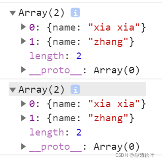
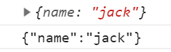
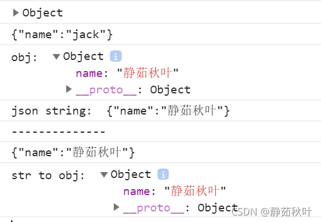
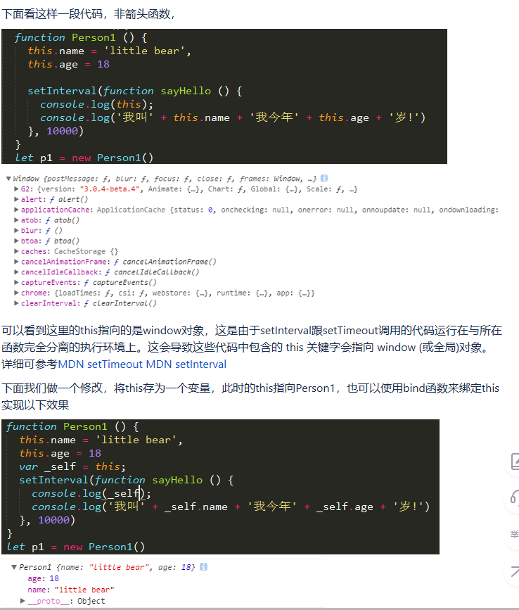

# JavaScript相关知识点 #

## 1.《学习JavaScript数据结构与算法》 ##

1.http-serve - js服务器,http-serve打开指定的端口访问

2.undefined - 声明变量未赋值

3. 
  1=="1" 对的 toNumber("1") = 1 1==1

  1===1 对的

4.delete运算符

5.js中的false

undefined null NaN +0 -0 长度为0的字符串 false

6.对象始终为true

> new Biilean(false) - true
> 
> new String('') - true
> 
> new Number(NaN) - true
> 
> {} - true

7.当使用 == 做比较时候会按照下表进行转换后比较

**例子**： console.log('packt'==true) ? 
输出为**false**

字符串与布尔比较，字符串转为数字再比，数字与字符串比较，字符串转为数组再比，则toNumber(true) = 1 , toNumber('packt') = NaN
1 != NaN , 所以结果为false，其余的也做同类型表

**关于** toPrimitive  
js的内部函数 - **数组就是对象**

> 对象转原始类型会调用内置的[toPrimitive]函数，该函数逻辑如下：
> 如果已经原始类型，就不需要转换
> 调用x.valueOf()，如果转换为基础类型，就返回转换的值
> 调用x.toString()，如果转换为基础类型，就返回转换的值
> 如果没有返回原始类型，就会报错

**什么时候使用？** - 对象类型与字符串或者数字比较的时候

**值得注意的是：** NaN不等于NaN NaN也不等于undefined  
使用isNaN判断

Number(b.toString())==Number(b.toString())  - 也返回false

8.当使用 === 判断时候，类型不相同直接返回false

**值得注意的是：**两个对象比较时候，两个引用同一个对象的时候才true，不同对象但相同结构仍为false(指针相关)，引用类型；--数组也是如此

9.面向对象编程时，对象是类的实例

10.js中函数原型只有一个形参时，传两个实参不会报错

11.什么时候用while什么时候用for？

知道执行次数的时候一般用for，条件循环时一般用while。

12.关于**函数原型** - prototype

使用函数原型定义函数时，函数只会被创建一次，直接定义则每个实例都会创建自己的函数副本。使用原型节约内存

### 原型 ###

proto（隐式原型）与prototype（显式原型，也叫原型对象）

①.是什么

> 显式原型：每一个函数在创建之后都会拥有一个名为prototype的属性，这个属性指向函数的原型对象。
> 
> 隐式原型：JavaScript中任意对象都有一个内置属性[[prototype]]，在ES5之前没有标准的方法访问这个内置属性，但是大多数浏览器都支持通过__proto__来访问。ES5中有了对于这个内置属性标准的Get方法
> Object.getPrototypeOf(). Object.prototype 这个对象是个例外，它的__proto__值为null

②.两者的关系和作用

>     关系：隐式原型指向创建这个对象的函数(constructor)的prototype
>     
>     作用：
>     显式原型的作用：用来实现基于原型的继承与属性的共享。
>     隐式原型的作用：构成原型链，同样用于实现基于原型的继承。举个例子，当我们访问obj这个对象中的x属性时，如果在obj中找不到，那么就会沿着__proto__依次查找。

③.图解

首先，要明确几个点：

(1).**在JS里，万物皆对象**。

方法（Function）是对象，方法的原型(Function.prototype)是对象。因此，它们都会具有对象共有的特点。

即：对象具有属性__proto__，可称为隐式原型，一个对象的隐式原型指向构造该对象的构造函数的原型，这也保证了实例能够访问在构造函数原型中定义的属性和方法。

(2).方法(Function)

方法这个特殊的对象，除了和其他对象一样有上述_proto_属性之外，还有自己特有的属性——原型属性（prototype），这个属性是一个指针，指向一个对象，这个对象的用途就是包含所有实例共享的属性和方法（我们把这个对象叫做原型对象）。

原型对象也有一个属性，叫做constructor，这个属性包含了一个指针，指回原构造函数。constructor属性用来测试对象的类型，除此之外，就不要使用。同时，原型对象的__proto__指向Object.prototype

知道了这两个基本点，我们来看看上面这副图。

1).构造函数Foo()

构造函数的原型属性Foo.prototype指向了原型对象，在原型对象里有共有的方法，所有构造函数声明的实例（这里是f1，f2）都可以共享这个方法。

2).原型对象Foo.prototype

Foo.prototype保存着实例共享的方法，有一个指针constructor指回构造函数。

3).实例

f1和f2是Foo这个对象的两个实例，这两个对象也有属性 __ _proto___，指向构造函数的原型对象，这样子就可以像上面1所说的访问原型对象的所有方法啦。
另外：

构造函数Foo()除了是方法，也是对象啊，它也有 __ _proto___ 属性，指向谁呢？
指向它的构造函数的原型对象呗。函数的构造函数不就是Function嘛，因此这里的 __ _proto___指向了Function.prototype。

其实除了Foo()，Function(), Object()也是一样的道理。

原型对象也是对象啊，它的 __ _proto___属性，又指向谁呢？

同理，指向它的构造函数的原型对象呗。这里是Object.prototype.

最后，Object.prototype的 __ _proto___属性指向null。

**总结：**

对象有属性 __ _proto___ ,指向该对象的构造函数的原型对象。

方法除了有属性 __ _proto___,还有属性prototype，prototype指向该方法的原型对象。

13.关于js调试工具部分

ctrl+shift+I

**14.JS中map()方法！！**

map定义和方法 map()方法返回一个新数组，数组中的元素为原始数组元素调用函数处理的后值。

map()方法按照原始数组元素顺序依次处理元素。

    map() 方法创建一个新数组，其结果是该数组中的每个元素都调用一个提供的函数后返回的结果。
    var array1 = [1,4,9,16];
    const map1 = array1.map(x => x *2);
    console.log(map1);

### 15.深拷贝浅拷贝 ###
**①.概念**

深拷贝与浅拷贝在其它语言中也经常被提及到，因为它们分别对应着**值拷贝**与**引用拷贝**。 

**深拷贝：**从字面上的意思理解，是指很深的拷贝，到底有多深呢？深到不仅拷贝值，而且还独立开辟了一个空间。我的理解是：拷贝的过程中，独立地开辟了一个空间，这个对象指向这个地址，与原来的对象互不干扰。深拷贝也被称为值拷贝。 

**浅拷贝：**从字面上的意思理解，是指比较浅的拷贝，它与原来的变量仍然指向同一个地址，两者之间相互影响，即其中一个改变会影响另一个的改变。**浅拷贝也被称为引用拷贝**，引用的意思就是取了个别名，例如张三是大名，狗蛋是他的引用，即为小名，张三变了，狗蛋自然也变了，因为他们本质上就是指同一个人

**②.js中的深拷贝(值拷贝)**

js中的基本数据类型：String Number Boolean Null Undefined，在赋值的过程中都是值拷贝.
例如，let a = 10 ; b = a , 修改其中一个变量的值，不会影响到另一个变量的值

**③.js中的浅拷贝(引用拷贝)**

js中的对象数据类型：Object Array Function Map Set，在赋值过程中都是引用拷贝(指向同一个地址，相当于一个房间多了一个钥匙)

**④.将浅拷贝装换为深拷贝**

## Array深拷贝几种方法 -- slice()方法 ， concat方法 ， ES6语法中使用[...arr] , Array.from方法

## Object的深拷贝 -- Object.assign() ， 万能转换器JSON.parse(JSON.stringify(obj)) ， 
  
1）Array的深拷贝

###slice方法

> slice()操作数组时，不会对原数组有影响，会产出一个新的数组。

	 let arr1 = [1, 42, 5, 6]
	 let arr2 = arr1.slice()
	 arr2[0] = 100
	 console.log(arr1) // [1, 42, 5, 6]
	 console.log(arr2) // [100, 42, 5, 6]

数组arr2的改变未引起arr1的变化

###concat()方法

> 数组的concat()方法，能够连接两个数组，同样不会改变原来的数组。用一个空数组连接另一个数组，即可实现深拷贝。

	let arr3 = ['cat', 'dog', 'pig']
	let arr4 = [].concat(arr3)
	arr3[2] = 'big pig'
	console.log(arr3) // ['cat', 'dog', 'big pig']
	console.log(arr4) // ['cat', 'dog', 'pig']

###ES6语法中 ...

> ES6语法中的 …， 我经常在数组的深拷贝中用到。

	let arr5 = [0, 0, 1]
	let arr6 = [...arr5]
	arr5[0] = 10000
	console.log(arr5) // [10000, 0, 1]
	console.log(arr6) // [0, 0, 1]
  
2）Object的深拷贝

###Object.assign()方法

> ES6的Object.assign() Object.assign(target, …sources)用于对象的合并，将源对象中的所有可枚举属性，复制到目标对象中，并返回合并后的目标对象。后来的源对象的属性值，将会覆盖它之前的对象的属性。

	 let person = {
	     name: 'xia',
	     age: 25,
	     height: 160
	 }
	 let otherPerson = Object.assign({}, person)
	 person.age = 30
	
	 console.log(person)
	 console.log(otherPerson)

### 万能转换器（对Array和Object等都适用）

> 前面讲解了 Array和Object的深拷贝方法，但是对于有更深层次的结构关系（数组套数组 数组套对象 对象套对象等），上面的方法就失灵了，可以看下面的例子。

	let personArr = [{name: 'xia'}, {name: 'zhang'}]
	let otherPersonArr2 = [...personArr]
	personArr[0].name = 'xia xia'
	console.log(personArr)
	console.log(otherPersonArr2)

**万能转换器 JSON.parse(JSON.stringify(obj))深拷贝已有对象，它可以深拷贝多层级的，不用担心嵌套问题。**

- JSON.stringfy() 将对象序列化成json对象
- JSON.parse() 反序列化——将json对象反序列化成js对象

JSON.stingify(obj)将js中的对象转换成JSON字符串

	 let jack = {
	     name: 'jack'
	 }
	 console.log(jack)
	 console.log(JSON.stringify(jack))

它们在格式上有区别。下图中的第一个是对象，name没有双引号括起来。第二个是json字符串，其中，name用双引号括起来了

**JSON.parse()将json字符串解析成对象**

	 let obj = {
	     name: '静茹秋叶'
	 }
	 console.log('obj: ', obj)
	 console.log('json string: ', JSON.stringify(obj))
	
	 let str = JSON.stringify(obj)
	 console.log('--------------')
	 console.log(str)
	 console.log('str to obj: ', JSON.parse(str))

 
### 16.JS关于promise ###

> ECMAscript 6 原生提供了promise对象
> 
> Promise对象代表了未来将要发生的事件，用来传递异步操作的消息

①概述 
Promise是异步编程的一种解决方案，可以代替传统的解决方案--回调函数和事件。ES6统一了用法，并原生提供了Promise对象。作为对象，Promise有一下两个特点：

*1)对象的状态不受外界影响。 
*2)一旦状态改变了就不会在变，也就是说任何时候Promise都只有一种状态

②Promise的状态

### 17.JS箭头函数 ###

> 箭头函数都是匿名函数
> 
> 普通函数**可以**是匿名函数

	// 具名函数
	function func(){
	  // code
	}
	 
	// 匿名函数
	let func=function(){
	  // code
	}
	
	// 箭头函数全都是匿名函数
	let func=()=>{
	  // code
	}

> 箭头函数不能用于构造函数，不能使用new
> 
> 普通函数可以用于构造函数吗，从此创建对象实例

	function Person(name,age){
	   this.name=name;
	   this.age=age;
	}
	let admin=new Person("恩诺小弦",18);
	console.log(admin.name);
	console.log(admin.age);

> 箭头函数中的this的指向不同

普通函数中this总是指向<a style="color:red;">调用它的对象，</a>如果用作构造函数，this指向<a style="color:red;">创建的对象实例</a>。

箭头函数没有自己的this，它的this是继承而来，默认指向在定义它时所处的对象(宿主对象)。

 

> 其他区别 

- 箭头函数不能Generator函数，不能使用yeild关键字。 

	我们可以理解yield是一个暂停动作，这个暂停动作可以接受上一步的结果作为参数，也可以额将这一阶段执行的结果返回给外部。上面整个做菜过程，是可以临时掺杂其他的事情的，这就是yield的最大作用。
	了解了yield之后，更能理解generator的存在意义。实际上它和promise一样，是用来解决函数异步调用的。

- 箭头函数不具有prototype原型对象。
- 箭头函数不具有super。 

	*super 方法
	
	super作为函数调用时，代表父类的构造函数。
	ES6 要求，子类的构造函数必须执行一次super函数。子类B的构造函数之中的super()，代表调用父类的构造函数。
	注意，super虽然代表了父类A的构造函数，但是返回的是子类B的实例，即super内部的this指的是B的实例，因此super()在这里相当于A.prototype.constructor.call(this)。
	作为函数时，super()只能用在子类的构造函数之中，用在其他地方就会报错。
	
	*super 对象
	
	super作为对象时，在普通方法中，指向父类的原型对象，在静态方法中，指向父类。
	由于super指向父类的原型对象，所以定义在父类实例上的方法或属性，是无法通过super调用的。ES6 规定，在子类普通方法中通过super调用父类的方法时，方法内部的this指向当前的子类实例。由于this指向子类实例，所以如果通过super对某个属性赋值，这时super就是this，赋值的属性会变成子类实例的属性。
	如果super作为对象，用在静态方法之中，这时super将指向父类，而不是父类的原型对象。在子类的静态方法中通过super调用父类的方法时，方法内部的this指向当前的子类，而不是子类的实例。

- 箭头函数不具有new.target。 

	new.target允许你检测函数或构造方法是否是通过new运算符调用的，若函数或构造方法是由new调用的，则new.target属性的值指向该函数或构造函数，否则值为undefined。

> 总结：

- 箭头函数的 this 永远指向其上下文的 this ，任何方法都改变不了其指向，如 call() , bind() , apply() 

- 普通函数的this指向调用它的那个对象

### 18.匿名函数的应用 ###

1.绑定事件

	<input type="button" value="点击" id="btn">
	
	//javascript
	var btn=document.querySelector("#btn");    //querySelector是H5中新增的查找dom元素的方法
	    		btn.οnclick=function(){
	    			alert("");
	    		}

2.应用对象

	var obj={
	
	    animal:"汤姆猫",
	
	    voice:"喵喵喵~~",
	
	    CAT:function(){
	
	        return "我是"+this.animal+"，我会"+this.voice+"叫！";
	
	    }
	
	};
	
	alert(obj.CAT());

3.应用函数表达式

	//将匿名函数赋值给变量cat
	var cat=function(){
	
	    return "喵喵喵~~"
	}
	//调用方式与调用普通函数一样
	alert(cat());

4.回调函数的应用

	setInterval(function(){
	
	    console.log("我是每5秒执行一次的回调函数");
	},5000);

5.返回值

	function cat(){
	    //返回匿名函数
	    return function(){
	
	        return "喵喵喵~~";
	    }
	}
	//调用匿名函数
	alert(cat()());
	//或
	var mao=cat();
	alert(mao());

6.链式调用

	(function(animal) { 
	
	alert(animal); 
	
	return arguments.callee; 
	
	})('cat')('dog')('pig');

